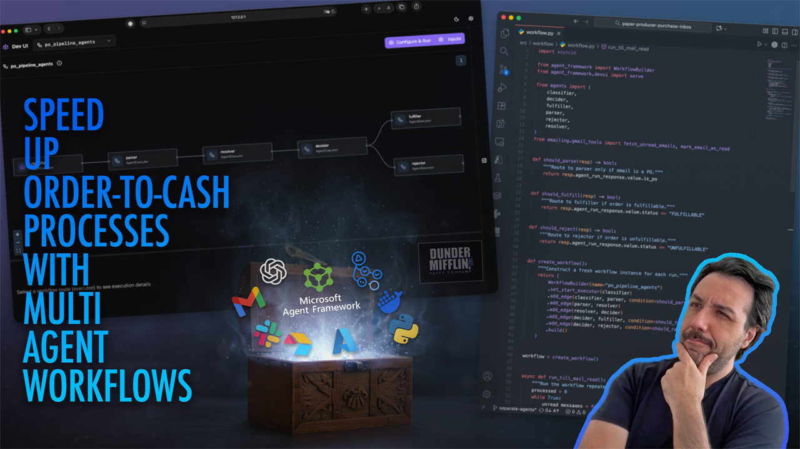

# PaperCo Purchase Order Intake Prototype

> [!IMPORTANT]
> This repo is an active prototype. The core Gmail → Airtable → Slack loop runs, but a few modules and tests are still catching up. Expect integration work before treating it as production-ready.

AI-assisted order-to-cash workflow that turns purchase-order emails into validated orders, gated human approvals, and invoice PDFs. The system leans on Azure OpenAI for reasoning, Azure AI Search for catalog/customer matching, Airtable as the temporary CRM, Gmail for intake/outbound replies, and Slack for human-in-the-loop confirmations.

---



## What Works Today

- Gmail polling (`src/workflow/workflow.py`) runs the multi-agent pipeline end-to-end.
- Agents call Azure OpenAI through `agent_framework` with prompt-injection and content-safety guards before parsing emails.
- Azure AI Search indexes (products + customers) back the `retriever` agent’s enrichment and credit math.
- Fulfillment path generates an invoice PDF (WeasyPrint) and uploads it to Azure Blob Storage before asking Slack for approval and emailing the customer.
- Rejection path sends a polite denial email with the decider’s rationale.
- Observability hooks (Application Insights / OTEL) initialize automatically from `agents/base.py`.

## What Still Needs Work

- Tests under `tests/` reference older Slack helpers (`slack_msg_sender`) and fail until rewritten for `messaging/slack_approval.py`.
- CRM sync beyond Airtable (e.g., Dynamics/SAP), REST wrappers, container deployment scripts, and scheduled processors are still TODO.
- `main.py` and `src/job_container_mail_checker.py` are placeholders.
- Groundedness/fact-checker agent scaffolding exists but is not yet wired into the workflow DAG.

---

## System Overview

1. **Inbox triage** – `agents/email_classifier.py` calls `get_unread_emails()` (Gmail API) and decides which message is a purchase order.
2. **Safety & parsing** – `agents/email_parser.py` runs the email body through Azure Content Safety (`safety/prompt_shield.py`, `safety/content_filter.py`) before extracting customer data and line items.
3. **Enrichment & credit check** – `agents/retriever.py` uses Azure AI Search (`aisearch/azure_search_tools.py`) to match customers/products, compute availability, credit exposure, and totals.
4. **Decision** – `agents/decider.py` approves or rejects the order based on inventory and credit fields populated by the retriever.
5. **Fulfillment path** – `agents/fulfiller.py`:
   - Generates an invoice PDF via `invoice/invoice_tools.py` and uploads it to Azure Blob Storage.
   - Posts to Slack (`messaging/slack_approval.py`) and blocks for a human `approve` / `deny`.
   - On approval: sends a confirmation email, decrements Airtable inventory, updates customer credit, and re-ingests data into Azure AI Search.
6. **Rejection path** – `agents/rejector.py` sends a rejection email with the decider’s rationale.
7. **Loop control** – `src/workflow/workflow.py` keeps polling Gmail until the unread queue is empty, marking each processed message read.

See `workflow.md` for the ASCII diagram and quick command checklist.

### Architecture at a Glance

```txt
           +-----------------------+
           |      Gmail Inbox      |
           |  (unread PO queue)    |
           +-----------+-----------+
                       |
                       v
            +----------+-----------+
            | Workflow Orchestrator|
            | (workflow.run_loop)  |
            +----------+-----------+
                       |
        +--------------+--------------+
        |  Agent Pipeline (LLM)       |
        | classifier → parser →       |
        | retriever → decider → ...   |
        +-------+--------------+------+
                |              |
                |              +-----------------------+
                |                                      |
                v                                      v
     +----------+-----------+                +---------+---------+
     |  Azure AI Search     |                |  Azure OpenAI     |
     | (vector + semantic   |                |  (policy & prompts|
     |  lookups for match)  |                |  for every agent) |
     +----------+-----------+                +---------+---------+
                |                                      |
                +------------------+-------------------+
                                   |
                                   v
                    +--------------+----------------+
                    | Fulfillment Toolkit           |
                    | Airtable API, invoice PDF gen |
                    | inventory + credit updates    |
                    +--------------+----------------+
                                   |
          +------------------------+-------------------------+
          |                                                  |
          v                                                  v
+---------+---------+                              +---------+---------+
| Azure Blob Storage|                              | Slack Approval    |
|  (store invoice   |                              |  (human decision) |
|   PDFs + links)   |                              | posts + polling)  |
+---------+---------+                              +---------+---------+
          |                                                  |
          +------------------------+-------------------------+
                                   |
                                   v
                          +--------+--------+
                          | Gmail Responses |
                          | (confirm/decline|
                          |  customer email)|
                          +-----------------+
```

### Safety Guardrails

- Prompt-injection screening (Azure Prompt Shield) and content classification must succeed before parsing.
- Manual approval required on every fulfillment via Slack thread replies.
- Email replies are templated; agents never execute arbitrary instructions from inbound messages.

### Data Inputs

- Synthetic CRM dataset lives under `data/sample/`. Upload to Airtable with `python scripts/upload_sample_data.py` before running the workflow.

---

## Prerequisites

- Python 3.11+ (repo developed against 3.12).
- Azure subscription with access to Azure OpenAI, Azure AI Search, Azure Blob Storage, and Content Safety. Managed identity or `DefaultAzureCredential` must be able to fetch tokens.
- Slack workspace with a bot token that can post to your approval channel.
- Gmail account with API access (OAuth desktop client).
- Airtable base (free tier is fine) for the synthetic CRM tables.
- Local libraries for WeasyPrint (libpangocairo, libpangoft2, etc.). On macOS: `brew install pango cairo gdk-pixbuf libffi`.

---

## Setup

1. **Clone & install**

   ```bash
   python -m venv .venv
   source .venv/bin/activate  # or .venv\Scripts\activate on Windows
   pip install --upgrade pip
   pip install -r requirements.txt
   ```

2. **Environment configuration**  
   Create `.env` in the repo root (never commit secrets). Minimum variables referenced in code:
   - **Azure OpenAI / AI Services**
     - `AZURE_OPENAI_ENDPOINT`
     - `AZURE_OPENAI_CHAT_DEPLOYMENT_NAME`: Needed for using _Azure OpenAI ChatCompletion **agents**_
     - `AZURE_AI_PROJECT_ENDPOINT`
     - `AZURE_OPENAI_EMBEDDING_DEPLOYMENT_NAME`
     - `AZURE_STORAGE_CONNECTION_STRING` (account URL used with `DefaultAzureCredential`)
     - `CONTENT_SAFETY_ENDPOINT`
     - `APPLICATIONINSIGHTS_CONNECTION_STRING` (optional but enables telemetry)
   - **Azure AI Search**
     - `AZURE_SEARCH_ENDPOINT`
   - **Slack**
     - `SLACK_BOT_TOKEN`
     - `SLACK_APP_TOKEN` (for Socket Mode if you extend interactivity)
     - `SLACK_APPROVAL_CHANNEL` (channel ID preferred; default fallback is `orders`)
   - **Airtable**
     - `AIRTABLE_API_KEY`
     - `AIRTABLE_BASE_ID`
     - `AIRTABLE_PRODUCTS_TABLE` (defaults to `Products`)
     - `AIRTABLE_CUSTOMERS_TABLE` (defaults to `Customers`)
   - **Observability toggles**
     - `ENABLE_TELEMETRY`, `ENABLE_OTEL`, `ENABLE_SENSITIVE_DATA`, `OTEL_*` (see `.env` for current defaults)

   Load additional secret material (keys, connection strings) via Azure Key Vault or your preferred secret store in production.

3. **Gmail credentials**
   - Enable the Gmail API in Google Cloud Console.
   - Create an OAuth client (Desktop) and download `credentials.json`.
   - Place it in `cred/credentials.json`. The first run prompts a browser consent and stores the token in `cred/token.json`.

4. **Airtable base**
   - Create a new base (e.g., `PaperCo Demo`).
   - Create two empty tables: `Products` and `Customers`.
   - Upload sample data: `python scripts/upload_sample_data.py`

5. **Azure AI Search indexes**
   - Ensure `AZURE_SEARCH_ENDPOINT`, `AZURE_OPENAI_ENDPOINT`, and `AZURE_OPENAI_EMBEDDING_DEPLOYMENT_NAME` are set.
   - Run the bootstrap script once per environment (rerun after CSV updates):

     ```bash
     python -m src.aisearch.azure_search_tools <<'PY'
     from aisearch.azure_search_tools import (
         create_products_index_schema,
         create_customer_index_schema,
         ingest_products_from_airtable,
         ingest_customers_from_airtable,
     )
     create_products_index_schema()
     create_customer_index_schema()
     ingest_products_from_airtable()
     ingest_customers_from_airtable()
     PY
     ```

6. **Slack app**
   - Create a bot with `chat:write`, `channels:history`, and Socket Mode if you extend interactions.
   - Invite the bot to your approval channel and store its channel ID in `SLACK_APPROVAL_CHANNEL`.

---

## Run the Workflow

```bash
python -m src.workflow.workflow
```

The loop processes unread Gmail messages one at a time:

1. Selects the top unread PO email.
2. Drives it through the agent DAG.
3. Blocks inside `send_confirmation_email_with_approval()` until someone replies `approve` or `deny` in Slack.
4. Sends the appropriate Gmail reply and marks the original message as read.

Run from a shell session that can open the browser for Gmail OAuth on first launch. For local debugging, you can enable the agent dev UI by uncommenting the `serve()` call at the bottom of `src/workflow/workflow.py`.

---

## Repository Layout

```txt
paper-producer-purchase-inbox/
├── data/sample/             # Synthetic Airtable CSVs + dataset README
├── docs/                    # Design notes, approval guides, safety docs
├── infra/                   # Bicep templates and deployment scripts
├── src/
│   ├── agents/              # Classifier, parser, retriever, decider, fulfiller, rejector
│   ├── aisearch/            # Azure AI Search schemas, ingestion helpers, search tools
│   ├── crm/                 # Airtable API helpers (add customer, update inventory/credit)
│   ├── emailing/            # Gmail auth, fetch, reply helpers (AI and non-AI functions)
│   ├── invoice/             # Invoice HTML template + PDF generator
│   ├── messaging/           # Slack approval workflow
│   ├── safety/              # Prompt shield, content filter, groundedness stubs
│   └── workflow/            # Workflow builder / orchestrator
├── tests/                   # Slack approval tests (need updates for new module names)
└── workflow.md              # ASCII pipeline map and quick reference
```

Key files:

- `src/workflow/workflow.py` – orchestration entry point (`run_till_mail_read()`).
- `src/agents/fulfiller.py` – Slack approval gate + Airtable updates + invoice generation.
- `src/aisearch/azure_search_tools.py` – index definitions, ingestion, and search AI tools.
- `src/emailing/gmail_tools.py` – Gmail integration (OAuth, fetch, reply, mark-as-read).
- `src/messaging/slack_approval.py` – post + poll approval threads.

---

## Testing & Verification

- Local unit tests require patching due to renamed Slack helper (`messaging.slack_approval`). Until fixed, `pytest` will fail on import errors.
- Manual smoke test: send a sample PO email, confirm Slack approval prompt appears, approve in Slack, verify confirmation email + Airtable updates + invoice blob upload.
- Azure observability is auto-enabled if `ENABLE_TELEMETRY` and related env vars are true; check Application Insights for agent traces and spans.

---

## Roadmap / Known Gaps

- Bring tests back to green and expand coverage for Gmail + Airtable edge cases.
- Wire the `fact_checker` / groundedness evaluation into the main workflow.
- Build a REST/GRPC layer or FastAPI wrapper for triggering workflows without shell access.
- Containerize the app and use Azure Container Apps or Functions for polling and scheduling.
- Harden error handling (retry policies for Slack, Airtable, Azure Search).

---

## License

MIT License.
